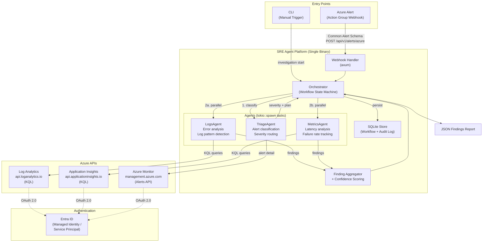
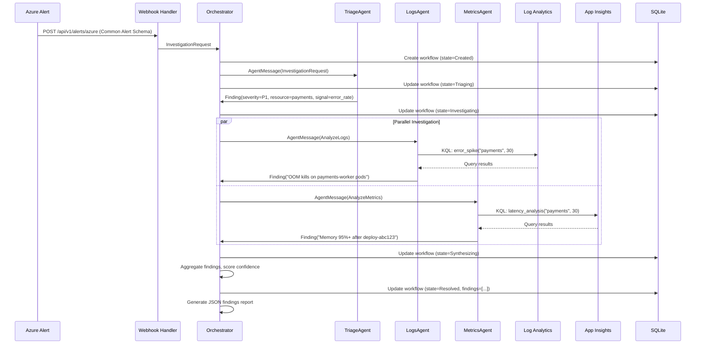
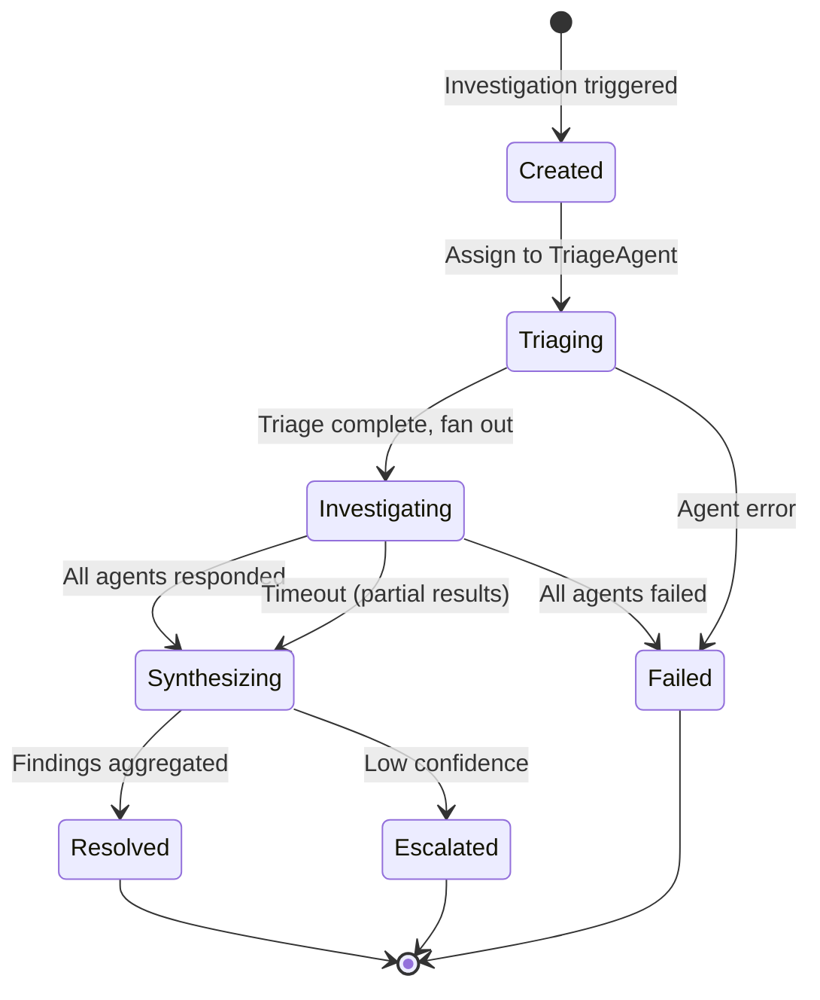
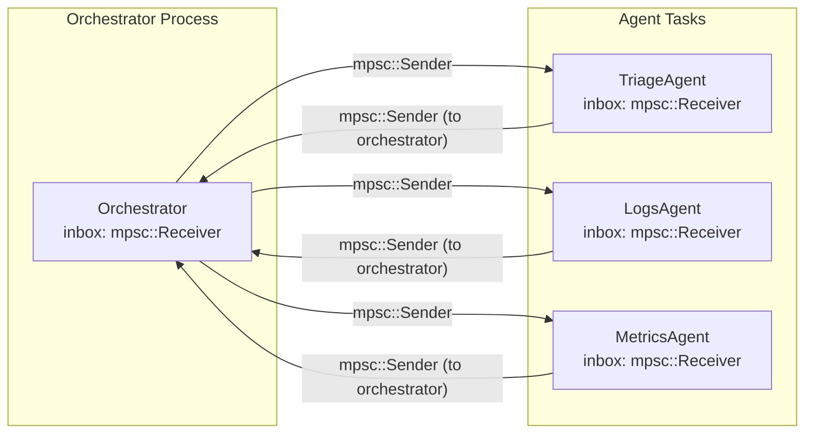

# Phase 1 — Architecture Diagram

## System Overview

```mermaid
graph TB
    subgraph "Entry Points"
        AZ_ALERT["Azure Alert<br/>(Action Group Webhook)"]
        CLI["CLI<br/>(Manual Trigger)"]
    end

    subgraph "SRE Agent Platform (Single Binary)"
        WH["Webhook Handler<br/>(axum)"]
        ORCH["Orchestrator<br/>(Workflow State Machine)"]
        
        subgraph "Agents (tokio::spawn tasks)"
            TRIAGE["TriageAgent<br/>Alert classification<br/>Severity routing"]
            LOGS["LogsAgent<br/>Error analysis<br/>Log pattern detection"]
            METRICS["MetricsAgent<br/>Latency analysis<br/>Failure rate tracking"]
        end
        
        AGG["Finding Aggregator<br/>+ Confidence Scoring"]
        STORE["SQLite Store<br/>(Workflow + Audit Log)"]
    end

    subgraph "Azure APIs"
        LA["Log Analytics<br/>api.loganalytics.io<br/>(KQL)"]
        AI["Application Insights<br/>api.applicationinsights.io<br/>(KQL)"]
        AM["Azure Monitor<br/>management.azure.com<br/>(Alerts API)"]
    end

    subgraph "Authentication"
        ENTRA["Entra ID<br/>(Managed Identity /<br/>Service Principal)"]
    end

    OUTPUT["JSON Findings Report"]

    AZ_ALERT -->|"Common Alert Schema<br/>POST /api/v1/alerts/azure"| WH
    CLI -->|"investigation start"| ORCH
    WH --> ORCH
    
    ORCH -->|"1. classify"| TRIAGE
    TRIAGE -->|"severity + plan"| ORCH
    
    ORCH -->|"2a. parallel"| LOGS
    ORCH -->|"2b. parallel"| METRICS
    
    LOGS -->|"findings"| AGG
    METRICS -->|"findings"| AGG
    AGG --> ORCH
    
    LOGS -->|"KQL queries"| LA
    METRICS -->|"KQL queries"| AI
    TRIAGE -->|"alert detail"| AM
    
    LA -.->|"OAuth 2.0"| ENTRA
    AI -.->|"OAuth 2.0"| ENTRA
    AM -.->|"OAuth 2.0"| ENTRA
    
    ORCH -->|"persist"| STORE
    ORCH --> OUTPUT
```

## Investigation Execution Flow

```mermaid
sequenceDiagram
    participant AZ as Azure Alert
    participant WH as Webhook Handler
    participant O as Orchestrator
    participant T as TriageAgent
    participant L as LogsAgent
    participant M as MetricsAgent
    participant LA as Log Analytics
    participant AI as App Insights
    participant DB as SQLite

    AZ->>WH: POST /api/v1/alerts/azure (Common Alert Schema)
    WH->>O: InvestigationRequest
    O->>DB: Create workflow (state=Created)
    
    O->>T: AgentMessage(InvestigationRequest)
    O->>DB: Update workflow (state=Triaging)
    T->>O: Finding(severity=P1, resource=payments, signal=error_rate)
    
    O->>DB: Update workflow (state=Investigating)
    
    par Parallel Investigation
        O->>L: AgentMessage(AnalyzeLogs)
        L->>LA: KQL: error_spike("payments", 30)
        LA-->>L: Query results
        L->>O: Finding("OOM kills on payments-worker pods")
    and
        O->>M: AgentMessage(AnalyzeMetrics)
        M->>AI: KQL: latency_analysis("payments", 30)
        AI-->>M: Query results
        M->>O: Finding("Memory 95%+ after deploy-abc123")
    end
    
    O->>DB: Update workflow (state=Synthesizing)
    O->>O: Aggregate findings, score confidence
    O->>DB: Update workflow (state=Resolved, findings=[...])
    O->>O: Generate JSON findings report
```

## Workflow State Machine

```mermaid
stateDiagram-v2
    [*] --> Created: Investigation triggered
    Created --> Triaging: Assign to TriageAgent
    Triaging --> Investigating: Triage complete, fan out
    Investigating --> Synthesizing: All agents responded
    Investigating --> Synthesizing: Timeout (partial results)
    Synthesizing --> Resolved: Findings aggregated
    Synthesizing --> Escalated: Low confidence
    Triaging --> Failed: Agent error
    Investigating --> Failed: All agents failed
    Escalated --> [*]
    Resolved --> [*]
    Failed --> [*]
```

## Agent Communication (mpsc channels)

```mermaid
graph LR
    subgraph "Orchestrator Process"
        O["Orchestrator<br/>inbox: mpsc::Receiver"]
    end
    
    subgraph "Agent Tasks"
        T["TriageAgent<br/>inbox: mpsc::Receiver"]
        L["LogsAgent<br/>inbox: mpsc::Receiver"]
        M["MetricsAgent<br/>inbox: mpsc::Receiver"]
    end
    
    O -->|"mpsc::Sender"| T
    O -->|"mpsc::Sender"| L
    O -->|"mpsc::Sender"| M
    T -->|"mpsc::Sender (to orchestrator)"| O
    L -->|"mpsc::Sender (to orchestrator)"| O
    M -->|"mpsc::Sender (to orchestrator)"| O
```
