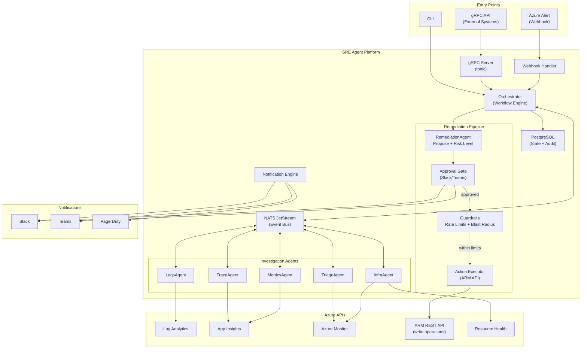
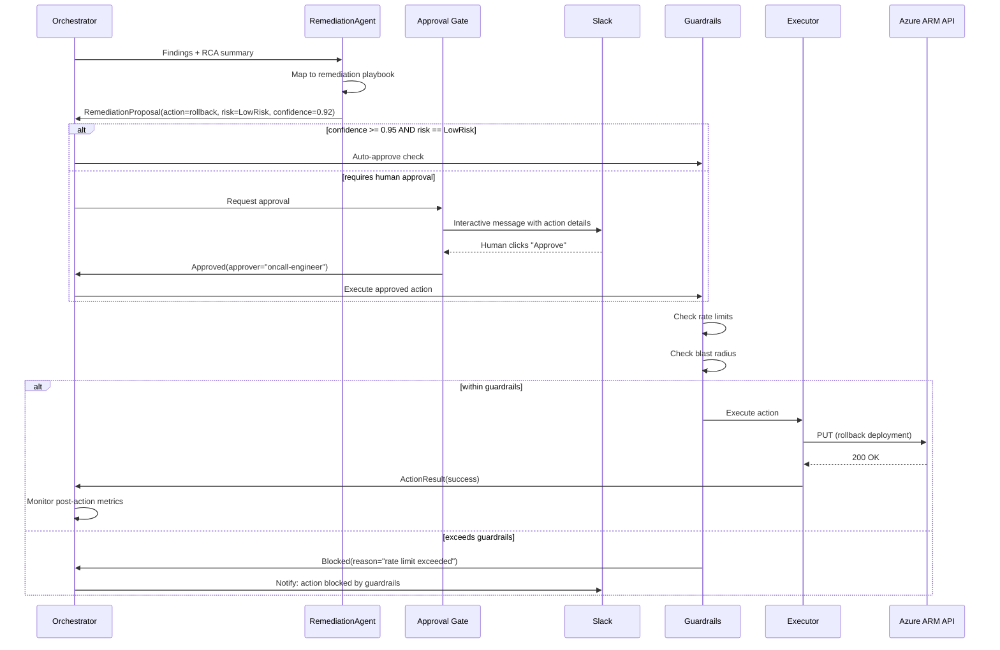

# Phase 2 — Architecture Diagram

## System Overview

```mermaid
graph TB
    subgraph "Entry Points"
        AZ_ALERT["Azure Alert<br/>(Webhook)"]
        GRPC["gRPC API<br/>(External Systems)"]
        CLI["CLI"]
    end

    subgraph "SRE Agent Platform"
        WH["Webhook Handler"]
        GRPC_SRV["gRPC Server<br/>(tonic)"]
        
        NATS["NATS JetStream<br/>(Event Bus)"]
        
        ORCH["Orchestrator<br/>(Workflow Engine)"]
        
        subgraph "Investigation Agents"
            TRIAGE["TriageAgent"]
            LOGS["LogsAgent"]
            METRICS["MetricsAgent"]
            TRACES["TraceAgent"]
            INFRA["InfraAgent"]
        end
        
        subgraph "Remediation Pipeline"
            REM["RemediationAgent<br/>Propose + Risk Level"]
            GATE["Approval Gate<br/>(Slack/Teams)"]
            EXEC["Action Executor<br/>(ARM API)"]
            GUARD["Guardrails<br/>Rate Limits + Blast Radius"]
        end
        
        PG["PostgreSQL<br/>(State + Audit)"]
        NOTIFY["Notification Engine"]
    end

    subgraph "Azure APIs"
        LA["Log Analytics"]
        AI["App Insights"]
        AM["Azure Monitor"]
        ARM["ARM REST API<br/>(write operations)"]
        RH["Resource Health"]
    end

    subgraph "Notifications"
        SLACK["Slack"]
        TEAMS["Teams"]
        PD["PagerDuty"]
    end

    AZ_ALERT --> WH --> ORCH
    GRPC --> GRPC_SRV --> ORCH
    CLI --> ORCH
    
    ORCH <--> NATS
    NATS <--> TRIAGE
    NATS <--> LOGS
    NATS <--> METRICS
    NATS <--> TRACES
    NATS <--> INFRA
    
    LOGS --> LA
    METRICS --> AI
    TRACES --> AI
    INFRA --> AM
    INFRA --> RH
    TRIAGE --> AM
    
    ORCH --> REM
    REM --> GATE
    GATE -->|"approved"| GUARD
    GUARD -->|"within limits"| EXEC
    EXEC --> ARM
    
    ORCH --> PG
    NOTIFY --> SLACK
    NOTIFY --> TEAMS
    NOTIFY --> PD
    GATE --> SLACK
    GATE --> TEAMS
```

## Remediation Flow

```mermaid
sequenceDiagram
    participant O as Orchestrator
    participant R as RemediationAgent
    participant G as Approval Gate
    participant S as Slack
    participant GR as Guardrails
    participant E as Executor
    participant ARM as Azure ARM API

    O->>R: Findings + RCA summary
    R->>R: Map to remediation playbook
    R->>O: RemediationProposal(action=rollback, risk=LowRisk, confidence=0.92)
    
    alt confidence >= 0.95 AND risk == LowRisk
        O->>GR: Auto-approve check
    else requires human approval
        O->>G: Request approval
        G->>S: Interactive message with action details
        S-->>G: Human clicks "Approve"
        G->>O: Approved(approver="oncall-engineer")
        O->>GR: Execute approved action
    end
    
    GR->>GR: Check rate limits
    GR->>GR: Check blast radius
    
    alt within guardrails
        GR->>E: Execute action
        E->>ARM: PUT (rollback deployment)
        ARM-->>E: 200 OK
        E->>O: ActionResult(success)
        O->>O: Monitor post-action metrics
    else exceeds guardrails
        GR->>O: Blocked(reason="rate limit exceeded")
        O->>S: Notify: action blocked by guardrails
    end
```
