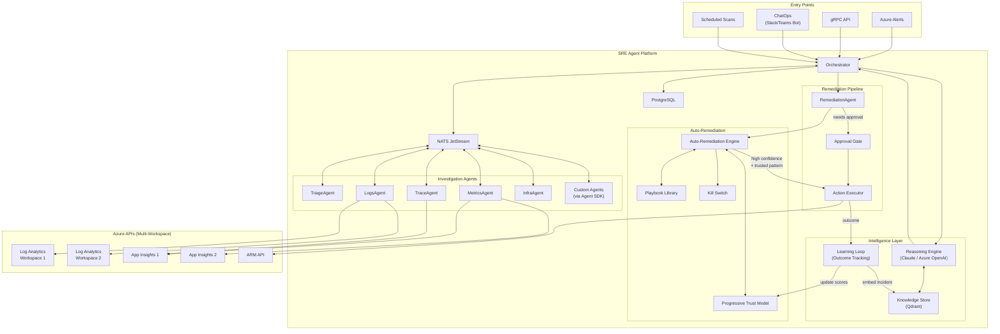
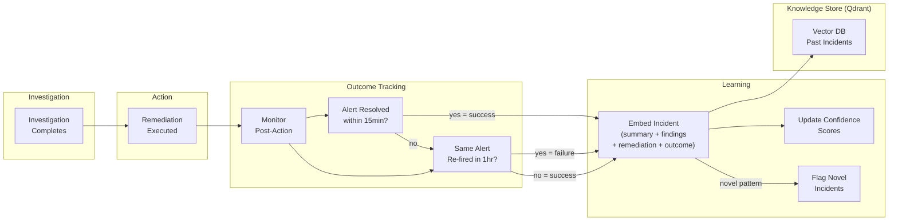
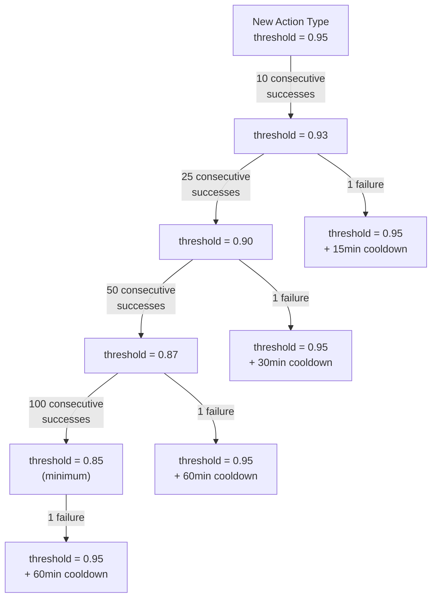

# Phase 3 — Architecture Diagram

## System Overview

```mermaid
graph TB
    subgraph "Entry Points"
        AZ_ALERT["Azure Alerts"]
        GRPC["gRPC API"]
        CHATOPS["ChatOps<br/>(Slack/Teams Bot)"]
        SCHEDULE["Scheduled Scans"]
    end

    subgraph "SRE Agent Platform"
        ORCH["Orchestrator"]
        NATS["NATS JetStream"]
        
        subgraph "Investigation Agents"
            TRIAGE["TriageAgent"]
            LOGS["LogsAgent"]
            METRICS["MetricsAgent"]
            TRACES["TraceAgent"]
            INFRA["InfraAgent"]
            CUSTOM["Custom Agents<br/>(via Agent SDK)"]
        end
        
        subgraph "Intelligence Layer"
            LLM["Reasoning Engine<br/>(Claude / Azure OpenAI)"]
            KNOW["Knowledge Store<br/>(Qdrant)"]
            LEARN["Learning Loop<br/>(Outcome Tracking)"]
        end
        
        subgraph "Auto-Remediation"
            AUTO["Auto-Remediation Engine"]
            TRUST["Progressive Trust Model"]
            PLAY["Playbook Library"]
            KILL["Kill Switch"]
        end
        
        subgraph "Remediation Pipeline"
            REM["RemediationAgent"]
            GATE["Approval Gate"]
            EXEC["Action Executor"]
        end
        
        PG["PostgreSQL"]
    end

    subgraph "Azure APIs (Multi-Workspace)"
        LA1["Log Analytics<br/>Workspace 1"]
        LA2["Log Analytics<br/>Workspace 2"]
        AI1["App Insights 1"]
        AI2["App Insights 2"]
        ARM["ARM API"]
    end

    AZ_ALERT --> ORCH
    GRPC --> ORCH
    CHATOPS --> ORCH
    SCHEDULE --> ORCH
    
    ORCH <--> NATS
    NATS <--> TRIAGE & LOGS & METRICS & TRACES & INFRA & CUSTOM
    
    LOGS --> LA1 & LA2
    METRICS --> AI1 & AI2
    TRACES --> AI1
    
    ORCH --> LLM
    LLM <--> KNOW
    LLM --> ORCH
    
    ORCH --> REM
    REM --> AUTO
    AUTO <--> TRUST
    AUTO <--> PLAY
    AUTO --> KILL
    
    AUTO -->|"high confidence<br/>+ trusted pattern"| EXEC
    REM -->|"needs approval"| GATE --> EXEC
    EXEC --> ARM
    
    EXEC -->|"outcome"| LEARN
    LEARN -->|"update scores"| TRUST
    LEARN -->|"embed incident"| KNOW
    
    ORCH --> PG
```

## Learning Loop

```mermaid
graph LR
    subgraph "Investigation"
        INV["Investigation<br/>Completes"]
    end
    
    subgraph "Action"
        ACT["Remediation<br/>Executed"]
    end
    
    subgraph "Outcome Tracking"
        MON["Monitor<br/>Post-Action"]
        RES["Alert Resolved<br/>within 15min?"]
        REFIRE["Same Alert<br/>Re-fired in 1hr?"]
    end
    
    subgraph "Learning"
        EMB["Embed Incident<br/>(summary + findings<br/>+ remediation + outcome)"]
        CONF["Update Confidence<br/>Scores"]
        FLAG["Flag Novel<br/>Incidents"]
    end
    
    subgraph "Knowledge Store (Qdrant)"
        VEC["Vector DB<br/>Past Incidents"]
    end
    
    INV --> ACT --> MON
    MON --> RES
    MON --> REFIRE
    
    RES -->|"yes = success"| EMB
    RES -->|"no"| REFIRE
    REFIRE -->|"yes = failure"| EMB
    REFIRE -->|"no = success"| EMB
    
    EMB --> VEC
    EMB --> CONF
    EMB -->|"novel pattern"| FLAG
```

## Progressive Trust Model

```mermaid
graph TD
    START["New Action Type<br/>threshold = 0.95"]
    
    START -->|"10 consecutive<br/>successes"| T1["threshold = 0.93"]
    T1 -->|"25 consecutive<br/>successes"| T2["threshold = 0.90"]
    T2 -->|"50 consecutive<br/>successes"| T3["threshold = 0.87"]
    T3 -->|"100 consecutive<br/>successes"| MIN["threshold = 0.85<br/>(minimum)"]
    
    T1 -->|"1 failure"| RESET1["threshold = 0.95<br/>+ 15min cooldown"]
    T2 -->|"1 failure"| RESET2["threshold = 0.95<br/>+ 30min cooldown"]
    T3 -->|"1 failure"| RESET3["threshold = 0.95<br/>+ 60min cooldown"]
    MIN -->|"1 failure"| RESET4["threshold = 0.95<br/>+ 60min cooldown"]
```
